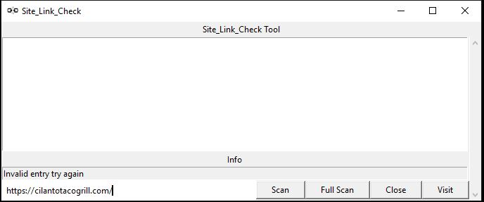

# site_link_check
Used to check if all the links in a given website return an error code
## WARNING
* Will not work on a site that doesn't support requests
* You'll know the site doesn't if it returns nothing and says "Invalid entry try again"
# 

### Directions
* Change to the directory that contains the 'interface.py'
* Run the code using 'python3 interface.py'
### What to expect
* A mostly blank window will open
* Input the URL of the site your want to check left of the scan button
* The initial scan will take a good amount of time. __Roughly 15 minutes per 1200 links__
* To update the scan you will need to use the Rescan button
* This scan may cause the window to say it's 'Not Responding'. Just wait. The terminal should be running the scan.
* Once the info displays, click the links and press the visit button to open the urls in the default browser
## Background
*My fiance's job gave her a task to check if all the links in one of their clients websites was working. So I said, "You know I could do that in like 40 lines of code". And here we are with 50 lines of code...
 
__lol__*
# Update
Enjoying the side project more than I thought so I decided to add some more __QoL__ code. Definitly not going to hit that 50 lines mark
* Interface GUI
